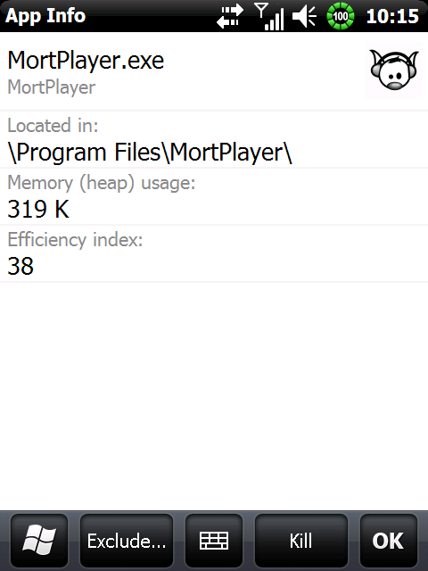
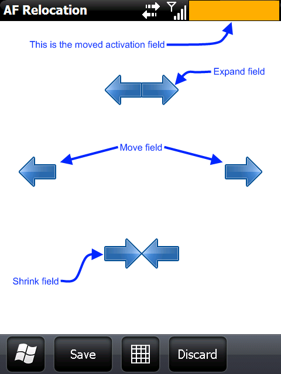

# **Project Description**
ArkSwitch is an easy to use, finger-friendly task manager for Windows Mobile 6.5.3 (with a WM6.5 compatibility mode). It is developed mainly in C#, with a C++ helper DLL.

# **About**
There are many task managers floating around out there, with lots of neat features and great UIs. I've been looking for a good replacement for the HTC Task Manager home screen button that no longer works properly in Windows Mobile 6.5.3, and I've been unable to find one I really like. So I made my own!

**IMPORTANT:** This application was designed specifically for WM6.5.3. Although it has been reported to work on WM6.5, I cannot recommend its use on that OS. You could enable WM6.5 compatibility mode, but it just wouldn't be the same without top bar integration.

**How to use:**
1. Install the CAB.
2. Either reboot (it will run on startup) or start it from the Start Menu --> Tools.
3. Click the left half of the top bar (or other area if customized) to bring it up.

**Theming:**
The new v1.1.0 default theme, designed by [Long Zheng](http://www.istartedsomething.com/), is customizable. Starting with this version of ArkSwitch, there is now a Theme directory that contains certain theme images and a config.xml file. The configuration entries should be self-explanatory. Background images are allowed, as people have been asking for them.

# **More Info**
Much more information about this project, including its evolution, can be found at its original home on xda-developers: [http://forum.xda-developers.com/showthread.php?t=618300](http://forum.xda-developers.com/showthread.php?t=618300)

# **Screenshots**
       